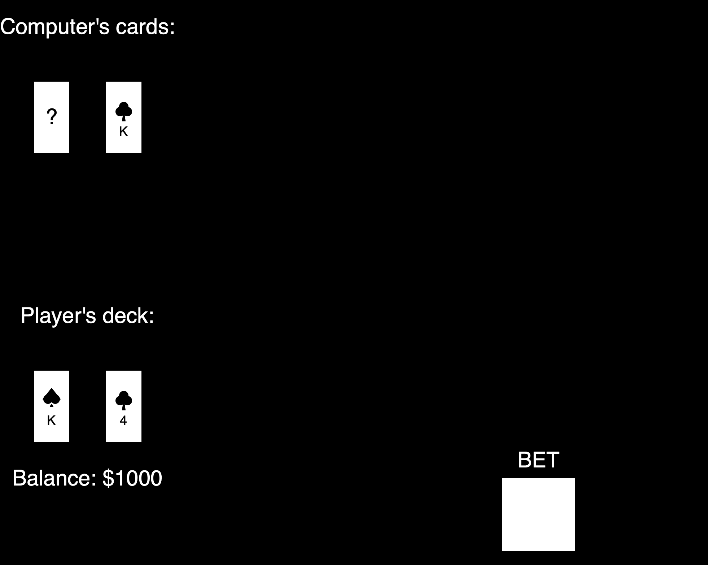
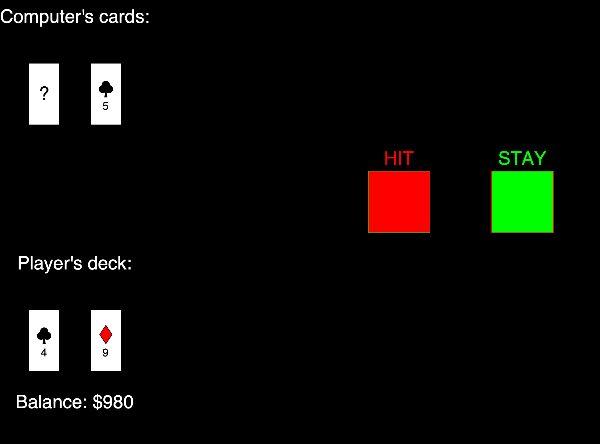

# Simplified Version of Black Jack Game
This was coded for completion of Python Bootcamp on Udemy. Graphical represantaion of cards was not required, however, in sake of practice I made my own graphical interface using graphics.py.

## *Rules:*
* Player starts with a balance of $1000 and 2 cards
* Computer starts with two cards, one of which is visible to player

Starting screen looks like this: 

* Before each round player has to bet ammount by clicking the BET button and typing in the ammount and admiting by Enter button on keyboard

After the bet has been set, the screen changes into:

* From now on it is a player's round - who can keep on HITting cards or STAY with cards that are currently present in player's deck.
  * The ultimate goal is to be closer to the sum of 21 within own deck than the computer
  * Player is going to loose current bet immediately after exceeding ammount of 21 on his hand - so be careful with HITting!
  
* After player has ended her/his round by clicking STAY button, computer will play it's own
  * Exact same rules apply to the computer
  
* After computer decided to STAY or exceeded ammount of 21, the final screen shows up with the information about the outcome of a round - all cards on the table are revealed

* On the final screen, BET button appears again. To start a new round just make a new BET!
